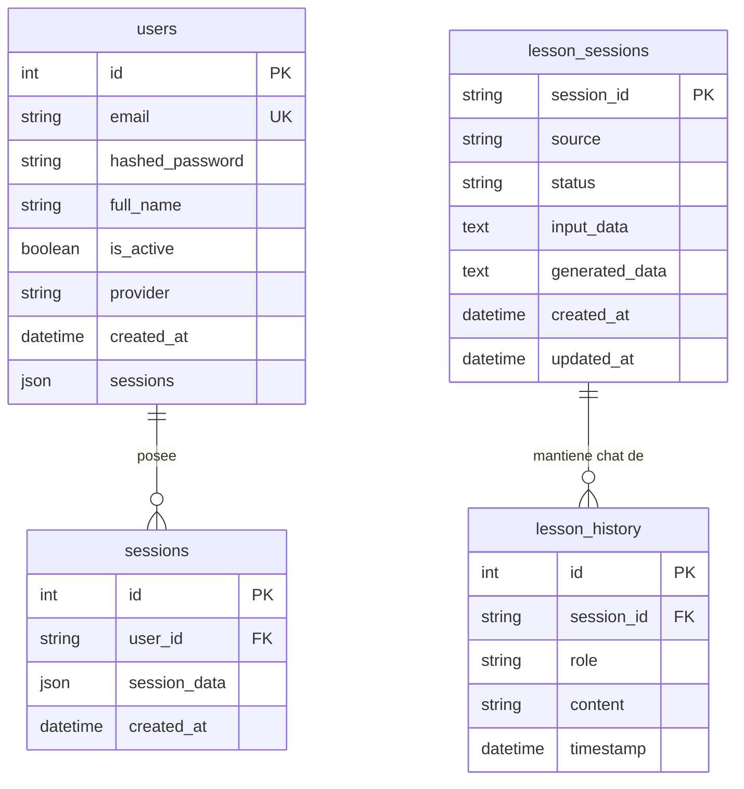

# 📊 Documentación de Base de Datos - EduAI

Este documento detalla la estructura completa de las bases de datos utilizadas en el ecosistema de **EduAI**, divididas en sus respectivos microservicios: **eduai-auth** (Servicio de Autenticación y Repositorio en PostgreSQL) y **eduai_core** (Servicio del Motor de IA en SQLite).

---

## 📈 Resumen del Ecosistema de Datos

El sistema maneja dos bases de datos complementarias:
1. **Autenticación y Repositorio (`eduai-auth`)**: Implementada sobre **PostgreSQL** (alojada en Render). Gestiona las credenciales de usuarios, perfiles, sesiones guardadas y la publicación en la biblioteca colaborativa.
2. **Motor de IA e Historial (`eduai_core`)**: Implementada sobre **SQLite** (`lesson_memory.db`). Gestiona de forma local y temporal los borradores del motor de IA, las configuraciones crudas y el historial de mensajes de interacción del asistente conversacional.

---

## 🔐 1. Base de Datos de Autenticación y Repositorio (`eduai-auth`)
* **Motor:** PostgreSQL (Render)
* **ORM:** SQLAlchemy (Python)

### Tabla: `users`
Esta tabla gestiona las cuentas de los docentes que acceden a la plataforma, soportando tanto autenticación local (correo/contraseña) como federada (Google).

| Campo | Tipo PostgreSQL | Atributos | Descripción |
| :--- | :--- | :--- | :--- |
| `id` | `INTEGER` | `PRIMARY KEY`, `SERIAL` | Identificador único del usuario. |
| `email` | `VARCHAR` | `UNIQUE`, `NOT NULL`, `INDEX` | Correo electrónico institucional o personal del docente. |
| `hashed_password` | `VARCHAR` | `NULLABLE` | Contraseña cifrada con hash (nula si el registro es vía Google). |
| `full_name` | `VARCHAR` | `NULLABLE` | Nombre completo del docente. |
| `is_active` | `BOOLEAN` | `DEFAULT: true` | Indica si la cuenta de usuario se encuentra activa. |
| `provider` | `VARCHAR` | `DEFAULT: 'email'` | Proveedor de autenticación (e.g. `'email'`, `'google'`). |
| `created_at` | `TIMESTAMP WITH TIME ZONE` | `DEFAULT: NOW()` | Fecha y hora de registro de la cuenta. |
| `sessions` | `JSON` | `NULLABLE`, `DEFAULT: []` | Lista opcional de metadatos o referencias rápidas a sesiones creadas. |

### Tabla: `sessions`
Almacena el repositorio de todas las sesiones de aprendizaje completadas y guardadas por los usuarios. Soporta tanto sesiones privadas como compartidas públicamente en la comunidad.

| Campo | Tipo PostgreSQL | Atributos | Descripción |
| :--- | :--- | :--- | :--- |
| `id` | `INTEGER` | `PRIMARY KEY`, `SERIAL` | Identificador numérico secuencial del registro. |
| `user_id` | `VARCHAR` | `NOT NULL`, `INDEX` | Correo o ID del docente propietario (Llave foránea lógica). |
| `session_data` | `JSONB` / `JSON` | `NOT NULL` | Bloque JSON estructurado que contiene todos los campos pedagógicos generados (Detalle abajo). |
| `created_at` | `TIMESTAMP WITH TIME ZONE` | `DEFAULT: NOW()` | Fecha y hora de creación y guardado en la base de datos. |

#### 📂 Estructura Detallada de `session_data` (JSON)
El campo `session_data` almacena el documento de planificación curricular completo. Sus campos internos principales son:
* **`tema`** (`string`): Título o tema central de la sesión.
* **`ciclo`** (`string`): Ciclo de Educación Básica Regular (e.g. `"VI"`, `"VII"`).
* **`contexto`** (`string`): Descripción del entorno sociocultural o demográfico de los estudiantes.
* **`horasClase`** (`number`): Duración estimada de la sesión de aprendizaje.
* **`competenciasSeleccionadas`** (`array[string]`): Competencias del Currículo Nacional (CNEB) seleccionadas.
* **`capacidades`** (`array[string]`): Capacidades movilizadas para esas competencias.
* **`competenciaDescripcion`** (`string`): Descripción formal de los logros esperados.
* **`criteriosEvaluacion`** (`string`): Rúbricas o criterios de calificación generados.
* **`evidenciasAprendizaje`** (`string`): Trabajos, productos o conductas evaluadas.
* **`secuenciaMetodologica`** (`object`): Actividades organizadas en:
  * `inicio` (`string`): Motivación, saberes previos y propósito.
  * `desarrollo` (`string`): Gestión, acompañamiento y modelado.
  * `cierre` (`string`): Transferencia, metacognición y autoevaluación.
* **`recursosAdicionales`** (`object`): Bloque de soporte con comunicado para padres, juego didáctico, fichas de trabajo, y problemas/ejercicios nivelados.
* **`is_public`** (`boolean`): Bandera para hacer la sesión visible a toda la red de docentes.
* **`author_name`** (`string`): Firma del autor para el repositorio colaborativo.
* **`likes`** (`number`): Conteo de valoraciones positivas recibidas por otros docentes.
* **`comments`** (`array`): Comentarios y retroalimentación de la comunidad.

---

## 🤖 2. Base de Datos de Inteligencia Artificial (`eduai_core`)
* **Motor:** SQLite (`lesson_memory.db`)
* **Controlador:** `sqlite3` nativo de Python

### Tabla: `lesson_sessions`
Registra el estado transaccional de los flujos de creación del motor de IA de GenAI, mapeando los estados del WebSocket y los prompts intermedios.

| Campo | Tipo SQLite | Atributos | Descripción |
| :--- | :--- | :--- | :--- |
| `session_id` | `TEXT` | `PRIMARY KEY` | Identificador único alfanumérico de la sesión de IA. |
| `source` | `TEXT` | `DEFAULT: 'frontend'` | Origen del llamado (e.g. `'frontend'`). |
| `status` | `TEXT` | `DEFAULT: 'draft'` | Estado de procesamiento (`'draft'`, `'generating'`, `'completed'`, `'failed'`). |
| `input_data` | `TEXT` | `JSON Stringified` | Parámetros del formulario de entrada enviados por el docente. |
| `generated_data` | `TEXT` | `JSON Stringified` | Respuesta estructurada final en formato JSON generada por Gemini. |
| `created_at` | `DATETIME` | `DEFAULT: CURRENT_TIMESTAMP` | Fecha de creación del borrador de planificación. |
| `updated_at` | `DATETIME` | `DEFAULT: CURRENT_TIMESTAMP` | Última actualización de estado o respuesta. |

### Tabla: `lesson_history`
Almacena el registro histórico de los mensajes intercambiados con el asistente conversacional para mantener la contextualización en cada chat de ajuste.

| Campo | Tipo SQLite | Atributos | Descripción |
| :--- | :--- | :--- | :--- |
| `id` | `INTEGER` | `PRIMARY KEY`, `AUTOINCREMENT` | Identificador único del mensaje. |
| `session_id` | `TEXT` | `INDEX` | ID de la sesión vinculada (Llave foránea lógica a `lesson_sessions`). |
| `role` | `TEXT` | `NOT NULL` | Rol del emisor del mensaje (e.g. `'user'`, `'model'`). |
| `content` | `TEXT` | `NOT NULL` | Contenido de texto del mensaje de chat. |
| `timestamp` | `DATETIME` | `DEFAULT: CURRENT_TIMESTAMP` | Registro temporal de envío del mensaje. |

---

> [!NOTE]
> La base de datos de producción de **eduai-auth** maneja todas las conexiones de forma eficiente sin pooling persistente (`NullPool`) para garantizar estabilidad bajo entornos serverless, y realiza migraciones automáticas al arrancar el backend en FastAPI.
